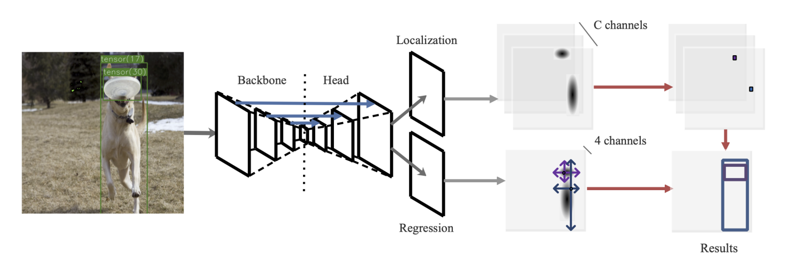

# SOLOv2-detectron2
Unofficial implementation for [TTFNet](https://arxiv.org/pdf/1909.00700.pdf) instance segmentation.  

*The weights will be published once the training is complete*.



## Install
The code is based on [detectron2](https://github.com/facebookresearch/detectron2). Please check [Install.md](https://github.com/facebookresearch/detectron2/blob/master/INSTALL.md) for installation instructions.


## Training 
Follows the same way as detectron2.

Single GPU:
```bash
python train_net.py --config-file configs/centernet_r_50_C4_1x.yaml
```
Multi GPU(for example 8):
```bash
python train_net.py --num-gpus 8 --config-file configs/centernet_r_50_C4_1x.yaml
```
Please adjust the IMS_PER_BATCH in the config file according to the GPU memory.


## Inference
First replace the original detectron2 installed postprocessing.py with the [file](https://github.com/gakkiri/SOLOv2-detectron2/blob/master/postprocessing.py).

Single GPU:
```
python train_net.py --config-file configs/centernet_r_50_C4_1x.yaml --eval-only MODEL.WEIGHTS /path/to/checkpoint_file
```
Multi GPU(for example 8):
```
python train_net.py --num-gpus 8 --config-file configs/centernet_r_50_C4_1x.yaml --eval-only MODEL.WEIGHTS /path/to/checkpoint_file
```

